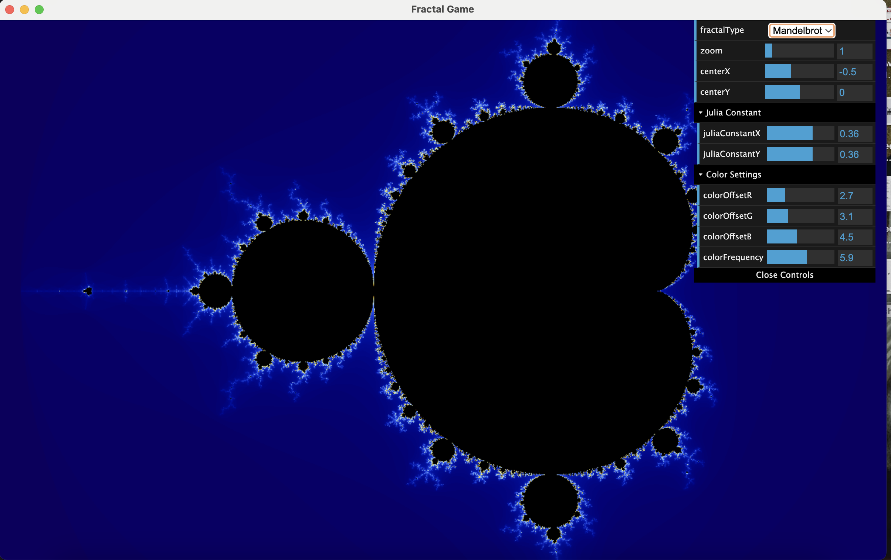
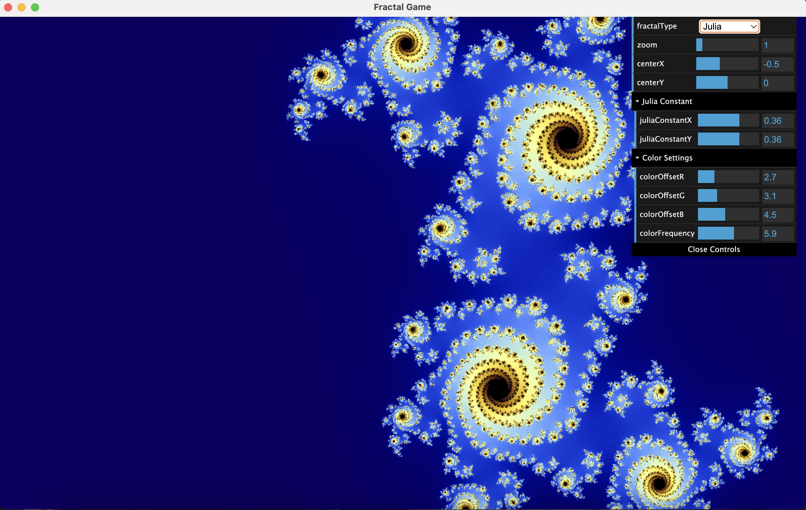

# Fractal Game

This repository features an interactive fractal explorer built with [Electron](https://www.electronjs.org/), [Three.js](https://threejs.org/), and [dat.GUI](https://github.com/dataarts/dat.gui). It allows you to switch between Mandelbrot and Julia sets, zoom in and out, pan across the plane, and customize color settings.

## Features

- **Mandelbrot and Julia Set** switching  
- **Zoom and Pan** via mouse controls  
- **Keyboard Shortcuts** to toggle fractals and adjust Julia constants  
- **Color Customization** using dat.GUI sliders (offset and frequency)  
- **Real-time Shader Rendering** with Three.js  

## Side-by-Side Preview

|  |  |
| :--------------------------------------------: | :----------------------------------------: |
|           **Mandelbrot Set**                   |              **Julia Set**                 |


## Installation

1. Clone this repository:
   ```bash
   git clone git@github.com:KeriYuu/fractal-game.git
   cd fractal-game
   ```
2. Install dependencies:
   ```bash
   npm install
   ```
3. Run the Electron application:
   ```bash
   npm start
   ```

## Usage

- **Toggle Fractal**: Press **J** to switch between Mandelbrot and Julia sets.  
- **Adjust Julia Constant** (in Julia mode): Use the **Arrow Keys**.  
- **Zoom**: Scroll with your mouse wheel (or trackpad gestures).  
- **Pan**: Click and drag.  
- **Color Customization**: A dat.GUI panel appears in the top-right corner. Adjust sliders to change color offset, frequency, and other parameters.  

## Mathematical Principles

### Mandelbrot Set

The Mandelbrot set is defined in the complex plane. For each complex number \( c \), we iterate:
\[
z_{n+1} = z_n^2 + c
\]
starting from \( z_0 = 0 \). If \( |z_n| \) (the magnitude of \( z_n \)) never exceeds 2 for all iterations (up to a chosen limit), \( c \) belongs to the Mandelbrot set.

### Julia Set

A Julia set is generated using the same iterative process, but \( c \) is fixed while different initial \( z_0 \) values in the plane are tested. Each point \( z \) that does not diverge for the chosen number of iterations is part of that specific Julia set. Changing \( c \) can drastically alter the shape of the set.